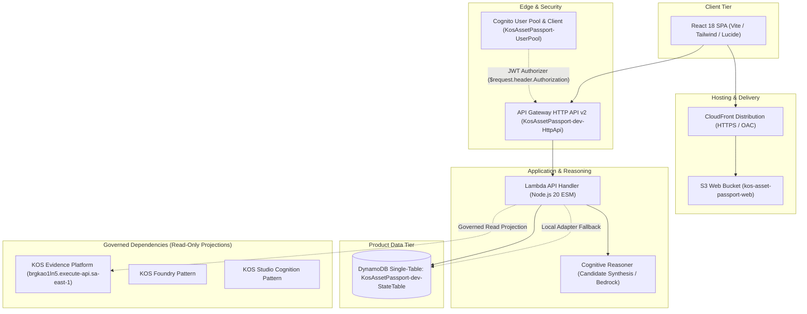

# Architecture Specification: KOS Asset Passport

**Authorship:** PIRESAAO / ACIDHUB KOS
**Product:** Asset Passport (`kos-asset-passport`)
**Sprint Date:** 2026-09-29
**Target AWS Region:** `sa-east-1`
**Security Model:** KEM/KEK Compatible

---

## 1. Product Thesis

Asset Passport answers, in ordinary language:
- *"What is this asset?"*
- *"What do we know about it?"*
- *"Where is it?"*
- *"What has changed?"*
- *"What evidence supports its current state?"*
- *"What deserves attention?"*

The user experiences an asset as a **living, explainable digital dossier**, not as a raw database record.

---

## 2. System Architecture

---

## 3. Epistemological and Spatial Principles

Because this is Asset Passport, spatial and evidential contexts are first-class, subject to rigorous separation:

1. **`SubjectIdentity != SpatialBinding`**:
   An asset's legal and functional identity is distinct from its spatial binding. Moving or re-surveying an asset does not alter its foundational identity.
2. **`Document != Evidence`**:
   A document is merely an artifact until admitted, evaluated, and sealed by governed processes.
3. **`Location != Provenance`**:
   Coordinates state where something was observed or reported, not where it originated or who authorized it.
4. **`AI Remains CANDIDATE`**:
   Any inference, attention flag, or synthesis generated by Bedrock or semantic reasoning is marked strictly as **CANDIDATE**. No automated authority transfer occurs without human-in-the-loop deliberation.
5. **`Product Events != Evidence Chronicle`**:
   Operational events recorded in `KosAssetPassport-dev-StateTable` are product-level lifecycle logs (`ASSET_CREATED`, `OBSERVATION_ADDED`, etc.) and never write to the Evidence Chronicle.
6. **`KOS != Runtime != Deployment != Product != DomainApp`**:
   KOS is a governed knowledge and capability graph, not a single monolithic runtime, deployment stack, or SaaS product.
7. **`SharedIdentity != SharedAuthorization != SharedState`**:
   Centralizing user recognition across KOS does not collapse product-specific authorization scopes or mix tenant persistence.
8. **`CapabilityIdentity != DeploymentLocation`**:
   Deployment topology does not dictate governance semantics.
9. **`ObservedDrift != ImmediateGlobalRefactor`**:
   Observed drift (e.g. Identity Fragmentation) informs architectural evolution through governed evaluation, not hasty global refactors.
10. **`BranchExistence != CanonicalPromotion` & `SelfReorganization != SelfAuthorization`**:
   Candidate branches may legitimately coexist. KOS can observe its own drift without authorizing its own redesign.

See [KOS End-of-Day Architectural Handoff](KOS_ARCHITECTURAL_HANDOFF_2026_09_29.md) for full taxonomy and consolidation.

---

## 4. DynamoDB Single-Table Schema

- **Table Name:** `KosAssetPassport-dev-StateTable`
- **Billing Mode:** Pay-per-request (`PAY_PER_REQUEST`)
- **Key Schema:**
  - Partition Key (`PK`): `STRING` (`TENANT#<tenantId>`)
  - Sort Key (`SK`): `STRING`
    - Assets: `ASSET#<assetId>`
    - Events: `EVENT#<assetId>#<occurredAt>#<eventId>`
- **Tenant Isolation:** All operations enforce tenant scoping through `PK = TENANT#<tenantId>`, preventing cross-tenant leakage.

---

## 5. Integration Boundaries

| Upstream Boundary | Priority Tier | Mode | Authority Boundary |
|---|---|---|---|
| KOS Evidence Platform (`brgkao1ln5`) | Priority 1 | Governed Read-Only API | Reads subject/passport/evidence projections. Never writes to Evidence tables. |
| KOS Foundry | Priority 2/3 | Reference Pattern | Capability context pattern reused; isolated deployment. |
| KOS Studio | Priority 4 | Cognitive Pattern | Candidate semantic synthesis pattern reused. |
| Local Adapter | Priority 5 | Deterministic Fallback | Provides offline resilience and Golden Fixture (Telecom Site AP-001) if upstream is unavailable. |
