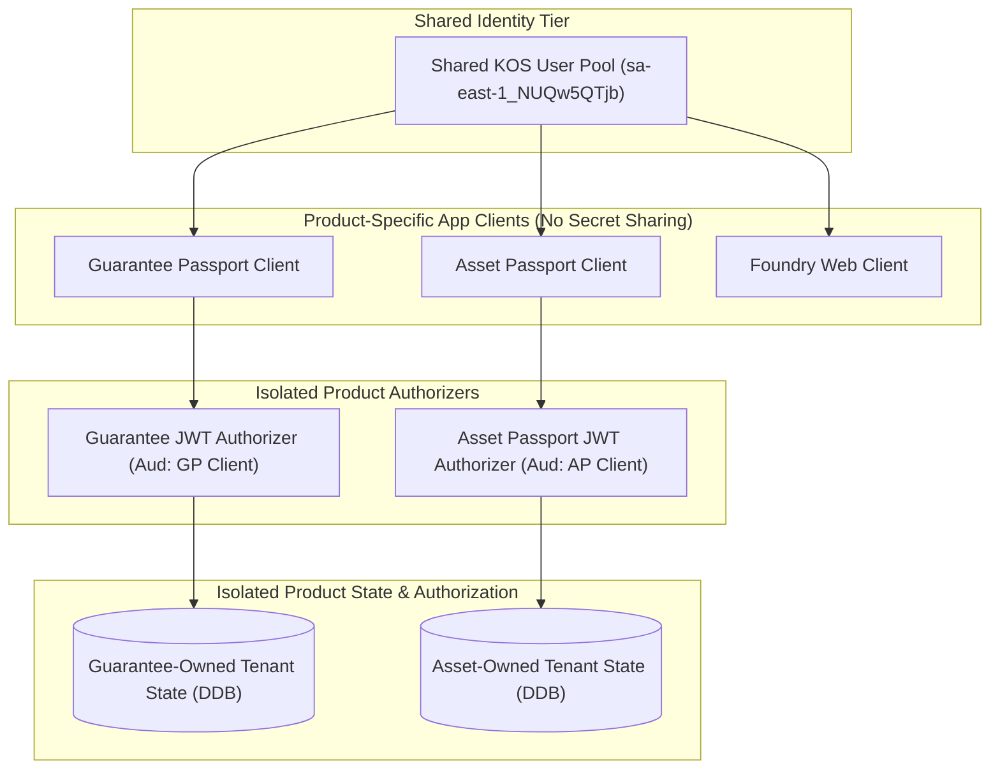

# KOS End-of-Day Architectural Handoff & Knowledge Consolidation

**Observation Date:** 2026-09-29
**Product Context:** KOS Asset Passport (`kos-asset-passport`) & Sibling KOS Projections
**Status:** CONSOLIDATION ONLY (No runtime mutation, no deployment, no refactoring)
**Authorship:** PIRESAAO / ACIDHUB KOS
**Governance Framework:** KEM / KEK Compatible

---

## 1. Foundational Axioms & Epistemic Boundaries

### [ESTABLISHED] Core Invariants
- **KOS != Runtime != Deployment != Product != DomainApp != Business Model:**
  KOS is fundamentally a governed knowledge and capability architecture, not a single monolithic runtime, not a specific CloudFormation deployment stack, not a single software product, and not an off-the-shelf SaaS/PaaS business packaging.
- **`CapabilityIdentity != DeploymentLocation`:**
  Deployment topology does not dictate governance semantics. Whether a capability is hosted in a dedicated Lambda in `sa-east-1`, co-located in an API Gateway, or executed on an edge worker does not alter its ontological boundary or identity.
- **`ReusablePattern != SharedAuthority`:**
  Reusing a DynamoDB single-table schema pattern or Cognito authorizer pattern in an isolated product projection does not confer shared administrative ownership or authorize cross-stack writes.
- **`SubjectIdentity != SpatialBinding`:**
  An asset's legal, functional, and governed identity is permanently decoupled from its spatial location coordinates.
- **`Document != Evidence`:**
  An ingested artifact or raw document is not evidence until formally admitted, verified, and sealed by governed processes.
- **`Location != Provenance`:**
  Coordinates record where an asset or observation was geographically bound, not its institutional origin, legal custody, or authorizer.
- **`AI == CANDIDATE` (Answer != Authority):**
  All inferences, attention flags, and natural language syntheses produced by cognitive models (Bedrock, Ollama, or local heuristic engines) remain strictly candidate propositions. Authority belongs exclusively to deliberative, governed human processes.
- **`MissingInformation != False`:**
  The absence of an inspection report, calibration certificate, or attribute establishes an informational gap, never factual non-existence or falsehood.
- **`ProductEvent != Evidence Chronicle`:**
  Operational product lifecycle events (`ASSET_CREATED`, `OBSERVATION_ADDED`, etc.) are local operational audit logs and never mutate or write to the Evidence Chronicle.

---

## 2. KOS as a Governed Capability Graph

### [ESTABLISHED] Subgraph Materialization
Evidence, Foundry, Companion, Steward, Living Sphere, Asset Passport, Guarantee Passport, and Assurance Monitor are nodes or subgraphs of a broader governed KOS capability graph.

- A client implementation does not require "installing all of KOS".
- A customer or domain workload materializes only the **admissible subgraph of capabilities** required by that specific journey and boundary condition.
- Domain applications consume projections from the graph; they do not need to reproduce the entire infrastructure footprint.

---

## 3. Observed Drift & Real-World Friction

### [OBSERVED] Identity Fragmentation Drift
During physical testing of the Guarantee Passport and Asset Passport sprint projections on 2026-09-29:
- **Observed Condition:** Guarantee Passport and Asset Passport deployed isolated product-local Cognito User Pools (`KosAssetPassport-UserPool` / `sa-east-1_yHYvI1jAM`).
- **Physical Symptom:** Physical logout and credential inspection exposed that canonical KOS principals (such as `alexandre@acidhub.com.br` in the shared Foundry/Evidence pool `sa-east-1_NUQw5QTjb`) did not exist in the product-local silos.
- **Classification:** `OBSERVED_DRIFT: IDENTITY_FRAGMENTATION`.
- **Governed Principle:** `ObservedDrift != ImmediateGlobalRefactor`.
  An observed architectural gap or drift condition must not trigger uncoordinated global refactoring, hidden technical debt, or customer-facing breakage.
- **Blocking Threshold:** An architectural gap becomes blocking only when it directly impairs a capability strictly required by the active user journey.

---

## 4. Candidate Architecture: Tripartite Separation of Identity

### [CANDIDATE] Disentangled Auth Topology
To resolve identity fragmentation in future governed cycles without coupling product state:

### [ESTABLISHED] Core Invariant:
$$\text{SharedIdentity} \neq \text{SharedAuthorization} \neq \text{SharedState}$$

1. **Shared Identity:** Common KOS principal recognition across the organization.
2. **Product Authorization:** Product-specific scopes, roles, and client-id audience checks.
3. **Tenant State Isolation:** Independent persistence and tenant-scoping with zero shared DynamoDB tables.

*Note: This candidate resolution is documented and preserved for future cycles; it is NOT being implemented tonight.*

---

## 5. Architectural Evolutionary Model

### [HYPOTHESIS] The $KOS_{t} \to KOS_{t+1}$ Transition Model
Architectural learning across implementations suggests a formalized candidate transition model:

$$KOS_t + \text{Observed Gaps} + \text{Observed Drift} + \text{Candidate Branches} + \text{Evidence} \xrightarrow{\text{Governed Evaluation}} \text{Promotion} \implies KOS_{t+1}$$

### [ESTABLISHED] Accompanying Principles:
- **`BranchExistence != CanonicalPromotion`:**
  Branching is legitimate. Candidate architectural branches and product projections may coexist without becoming canonical standard baselines.
- **`SelfReorganization != SelfAuthorization`:**
  KOS can observe, record, and reflect upon its own architectural gaps and drift conditions without possessing the authority to unilaterally redesign or mutate itself. Governed, deliberate promotion remains essential.

---

## 6. Cognitive & Operational Role Taxonomy

### [HYPOTHESIS] Proposed Structural Role Separation

| Role | Primary Responsibility | Focus | Authority Boundary |
|---|---|---|---|
| **Supervisor** | Operational and domain attention | Active system health, runbooks, metrics, alerts, SLA breaches | Operational / Telemetry |
| **Steward** | Architectural and knowledge coherence | Detecting gaps, drift, contradictions, and ontology divergence | Epistemic Coherence |
| **Companion** | Cognitive and explanatory capability | Conversational explanations, progressive disclosure, user mediation | Candidate Synthesis |
| **Provider** | Execution mechanism | Ollama, Bedrock, Anthropic, heuristic local engines | Compute / Execution |
| **Governed Authority** | Deliberation and promotion | Architectural promotion, gate transitions, policy decisions | Human / Deliberative |

*Status: Preserved as an architectural hypothesis awaiting canonical formalization.*

---

## 7. Status Classification Registry

- **ESTABLISHED:**
  - Decoupling of KOS from runtime/deployment/product/model.
  - Subgraph materialization pattern (no need to "install KOS").
  - `SharedIdentity != SharedAuthorization != SharedState`.
  - `CapabilityIdentity != DeploymentLocation`.
  - `ObservedDrift != ImmediateGlobalRefactor`.
  - `BranchExistence != CanonicalPromotion`.
  - `SelfReorganization != SelfAuthorization`.
  - Epistemological safeties (`SubjectIdentity != SpatialBinding`, `Document != Evidence`, etc.).
- **OBSERVED:**
  - Identity fragmentation between product-local Cognito pools and shared Foundry/Evidence pool.
  - Asset Passport local adapter baseline classified honestly as `FIXTURE_ONLY`.
- **CANDIDATE:**
  - Shared Cognito Pool with product-specific app clients and isolated authorizers.
  - Bounded intent routing layer before generic LLM invocation.
- **HYPOTHESIS:**
  - $KOS_t \to KOS_{t+1}$ continuous evolutionary loop.
  - Taxonomy of Supervisor / Steward / Companion / Provider / Governed Authority.
- **OPEN:**
  - When and under what governed milestone the Cognito identity unification migration should be executed.
  - Formal protocol for candidate branch promotion across distributed product workspaces.
